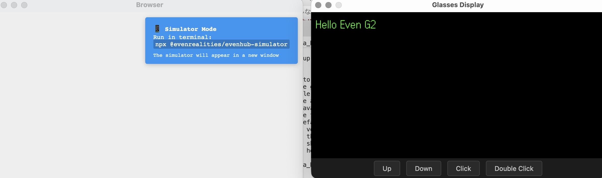
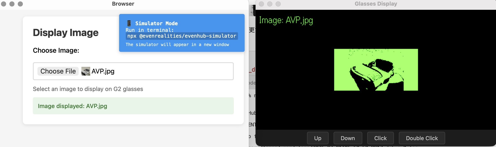
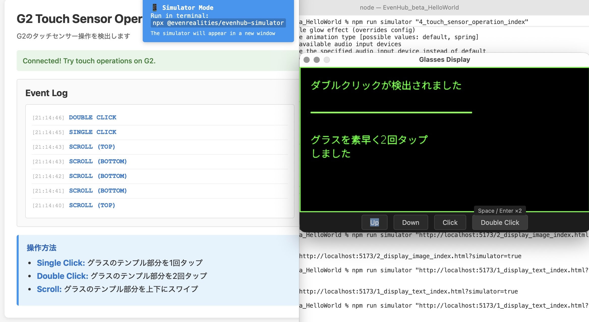

# Even Realities G2向けアプリ開発のためのシンプルなサンプルコード

できるだけシンプルなソースコードでアプリを作る開発方法をまとめました。シミュレータ、実機どちらでも動くようにしています。

## できること

1. **テキストのみを表示** (`1_display_text`)
2. **画像のみを表示** (`2_display_image`)
3. **タッチセンサー操作を検出** (`3_touch_sensor_operation`)


## 準備するもの  

### シミュレータで動作確認する場合
- 開発用PC

### 実機で動作確認する場合
- Even appがインストールされたiOS/Androidのスマートフォン(TestFlight相当で取得し、Even Hub機能が入っているもの. 2026/2/23時点)  
- Even G2実機  
- 開発用PC 

## 環境構築:開発用PC

```bash
$ git clone https://github.com/flushpot1125/even_g2_simple_code.git  
$ cd even_g2_simple_code
$ npm install
```

### シミュレータモードの起動

**ターミナルを2つ開いて実行：**

ターミナル1:
```bash
# 開発サーバー起動
npm run dev
```

ターミナル2:
```bash
# シミュレータ起動
npm run simulator "http://localhost:5173/1_display_text_index.html?simulator=true"
```


起動時に対象となるindex.htmlを変更することで、別の機能を表示できます。  

```bash
npm run simulator "http://localhost:5173/2_display_image_index.html?simulator=true"
```



補足：  
- スマートフォンから読み込む画像の解像度には制約がないようでした  
- Even G2側には200px x 100pxの領域にしないと表示されませんでした    
- jpg, bmpのどちらも表示できました  

```bash
npm run simulator "http://localhost:5173/3_touch_sensor_operation_index.html?simulator=true"
```



## 実機での起動

- 同一ネットワークに開発用PC、iPhone/Androidスマートフォンが接続されていることを確認  
- iPhone/AndroidスマートフォンとEven G2実機がBLE接続されていることを確認  


使用するhtmlファイルの名称をindex.htmlに変更する  

例：  
mv 1_display_text_index.html index.html


ターミナル1:
```bash
npm run dev
```

ターミナル2:
```bash
npm run qr
```

ターミナル2にQRコードが表示されるので、スマートフォンのEven Appから読み取ります。これで、シミュレータでの動作確認時と同じく、1_display_text_index.htmlと同じ結果がEven G2に表示されます。  


## トラブルシューティング

### シミュレータが表示されない

1. シミュレータプロセスが実行されているか確認：
   ```bash
   npm run simulator
   ```
2. ブラウザのURLに`?simulator=true`が含まれているか確認

3. シミュレータウィンドウが別のデスクトップや画面の外に表示されていないか確認

4. 依存関係を再インストール：
   ```bash
   npm install
   ```

### sh: evenhub-simulator: command not foundが表示される

以下を実行する。

```bash
npm rebuild @evenrealities/evenhub-simulator 
```

理由不明だが、npm installを実行して新しいパッケージをインストールするとevenhub-simulatorが見つからなくなる。  

 

## 参考資料

- [G2 Development Notes](https://github.com/nickustinov/even-g2-notes/blob/main/G2.md)
- [even-dev (開発環境)](https://github.com/BxNxM/even-dev)  


## 補足

- 開発用PCは、Azure/AWS/GCPなどのクラウドのサーバでも置き換えできると思います(近日中に検証予定)  
- 2026/2/23時点では、beta版のSDKで確認しています。そのため、SDKのアップデート状況で開発方針が変わる可能性があります。